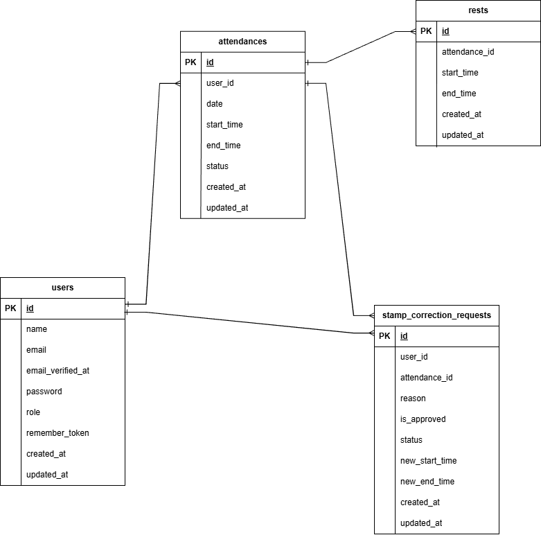

# coachtech 勤怠管理
## 環境構築
### Dockerビルド
1. `git clone git@github.com:matudairatora/furima.git`
2. `docker-compose up -d --build`
#### Laravel環境構築
1. `docker-compose exec php bash`
2. `composer install`
3. .env.exampleファイルから.envを作成し、環境変数を変更
4. .envに以下の環境変数を追加
    ``` text
    DB_CONNECTION=mysql
    DB_HOST=mysql
    DB_PORT=3306
    DB_DATABASE=laravel_db
    DB_USERNAME=laravel_user
    DB_PASSWORD=laravel_pass

    MAIL_MAILER=smtp
    MAIL_HOST=mailhog
    MAIL_PORT=1025
    MAIL_USERNAME=null
    MAIL_PASSWORD=null
    MAIL_ENCRYPTION=null
    MAIL_FROM_ADDRESS=hello@example.com
    MAIL_FROM_NAME="${APP_NAME}"

    ```
5. `php artisan key:generate`
6. `php artisan migrate:fresh`
7. `php artisan db:seed`
8. `php artisan storage:link`
9. `exit`
10. `brew install mailhog`
11. `brew services start mailhog`
12. `sudo chmod -R 777 *`


### PHPunitテスト
1.  `php artisan config:clear`
8.  `php artisan test`

### 管理者ユーザー
1.  name:管理者太郎
    email：admin@example.com
    password:password

### 一般ユーザー
1.  name:西怜奈
    email:reina.n@coachtech.com'
    password:password
2.  name:山田太郎
    email:taro.y@coachtech.com
    password:password
3.  name:増田一世
    email:issei.m@coachtech.com
    password:password
4.  name:山本敬吉
    email:keikichi.y@coachtech.com
    password:password
5.  name:秋田朋美
    email:tomomi.a@coachtech.com
    password:password
6.  name:中西教夫
    email:norio.n@coachtech.com
    password:password

### 使用技術
- PHP 8.0
- Laravel 10.0
- MySQL 8.0
- mailhog v1.0.1
- Fortify
- stripe 17.0

### ER図
- 
### URL
- 開発環境 http://localhost/
- phpMyAdmin http://localhost:8080/
- MailHog http://localhost:8025/
