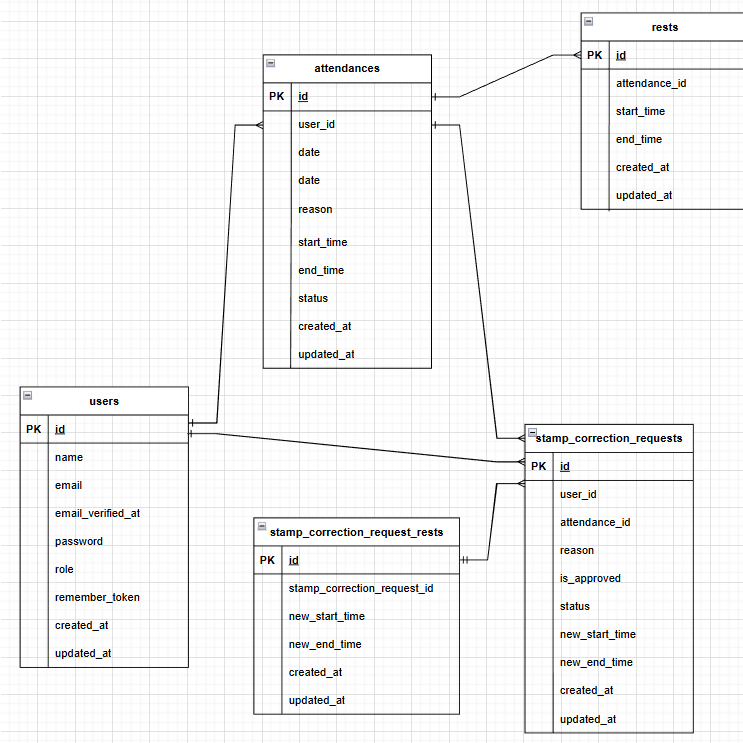

# coachtech 勤怠管理
## 環境構築
### Dockerビルド
1.  ```code 
    git clone git@github.com:matudairatora/furima.git
    ```
2.  ```code 
    docker-compose up -d --build
    ```
#### Laravel環境構築
1.  ```code 
    docker-compose exec php bash
    ```
2.  ```code 
    composer install
    ```
3. .env.exampleファイルから.envを作成し、環境変数を変更
4. .envに以下の環境変数を追加
    ``` text
    DB_CONNECTION=mysql
    DB_HOST=mysql
    DB_PORT=3306
    DB_DATABASE=laravel_db
    DB_USERNAME=laravel_user
    DB_PASSWORD=laravel_pass

    MAIL_MAILER=smtp
    MAIL_HOST=mailhog
    MAIL_PORT=1025
    MAIL_USERNAME=null
    MAIL_PASSWORD=null
    MAIL_ENCRYPTION=null
    MAIL_FROM_ADDRESS=hello@example.com
    MAIL_FROM_NAME="${APP_NAME}"

    ```
5.  ```code 
    php artisan key:generate
    ```
6.  ```
    php artisan migrate:fresh
    ```
7.  ```
    php artisan db:seed
    ```
8.  ```code
    exit
    ```
9.  ```code
    brew install mailhog
    ```
10. ```code
    brew services start mailhog
    ```
11. ```code
    sudo chmod -R 777 *
    ```


### PHPunitテスト
1.  ```code
    docker-compose exec mysql bash
    ```
2.  ```code
    mysql -u root -p
    ```
3.  ```code
    CREATE DATABASE laravel_test;
    GRANT ALL PRIVILEGES ON laravel_test.* TO 'laravel_user'@'%';
    EXIT;
    ```
4.  ```code
    php artisan test
    ```
4.  ```code
    php artisan migrate:fresh --seed
    ```

### 管理者ユーザー
1.  name:管理者太郎  
    email：
    ```text
    admin@example.com
    ```
    password:
    ```text
    password
    ```

    

### 一般ユーザー
1.  name:西怜奈  
    email:
    ```text
    reina.n@coachtech.com
    ```
    password:
    ```text
    password
    ```


2.  name:山田太郎  
    email:
    ```text
    taro.y@coachtech.com
    ```
    password:
    ```text
    password
    ```


3.  name:増田一世  
    email:
    ```text
    issei.m@coachtech.com
    ```
    password:
    ```text
    password
    ```


4.  name:山本敬吉  
    email:
    ```text
    keikichi.y@coachtech.com
    ```
    password:
    ```text
    password
    ```


5.  name:秋田朋美  
    email:
    ```text
    tomomi.a@coachtech.com
    ```
    password:
    ```text
    password
    ```


6.  name:中西教夫  
    email:
    ```text
    norio.n@coachtech.com
    ```
    password:
    ```text
    password
    ```

### 使用技術
- PHP 8.0
- Laravel 10.0
- MySQL 8.0
- mailhog v1.0.1
- Fortify

### ER図
- 
### URL
- 開発環境 http://localhost/
- 管理者ログイン画面 http://localhost/admin/login
- 一般ユーザーログイン画面 http://localhost/login
- phpMyAdmin http://localhost:8080/
- MailHog http://localhost:8025/
